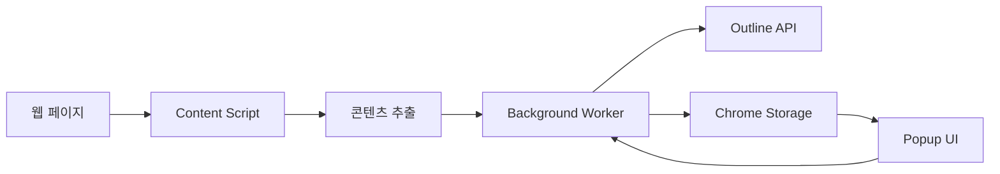

# Outline Web Clipper - 프로젝트 구조 문서

## 📋 프로젝트 개요
- **프로젝트명**: Outline Power Web Clipper
- **버전**: 2.0.0
- **설명**: Outline Wiki와 연동되는 Chrome Extension 웹 클리퍼
- **주요 기능**: 웹 페이지 내용을 추출하여 Outline Wiki에 저장

## 🏗️ 아키텍처 개요

### 기술 스택
- **프론트엔드**: React 18, TypeScript
- **빌드 도구**: Webpack 5
- **브라우저 API**: Chrome Extension Manifest V3
- **주요 라이브러리**:
  - @mozilla/readability: 웹 페이지 콘텐츠 추출
  - turndown: HTML to Markdown 변환
  - turndown-plugin-gfm: GitHub Flavored Markdown 지원

### Chrome Extension 구조
```
┌─────────────────────────────────────────────┐
│              Browser Tab                     │
├─────────────────────────────────────────────┤
│         Content Script (content.ts)          │
│    - DOM 접근 및 콘텐츠 추출                  │
│    - 사용자 선택 영역 처리                    │
│    - 하이라이트 기능                         │
├─────────────────────────────────────────────┤
│     Background Service Worker                │
│         (background.ts)                      │
│    - API 통신                               │
│    - 컨텍스트 메뉴 관리                      │
│    - 메시지 라우팅                           │
├─────────────────────────────────────────────┤
│          Popup UI (popup.tsx)                │
│    - 사용자 인터페이스                        │
│    - 설정 관리                              │
│    - 클리핑 옵션 선택                        │
└─────────────────────────────────────────────┘
```

## 📁 디렉토리 구조

```
outline-web-clipper/
├── src/                          # 소스 코드
│   ├── background.ts            # Background 서비스 워커
│   ├── content.ts              # Content 스크립트
│   ├── content.css             # Content 스타일
│   ├── manifest.json           # Chrome Extension 매니페스트
│   │
│   ├── features/               # 기능별 모듈
│   │   ├── content_extraction/ # 콘텐츠 추출
│   │   │   ├── extractor.ts   # 메인 추출 로직
│   │   │   └── link-processor.ts # 링크 처리
│   │   │
│   │   ├── outline_integration/ # Outline API 연동
│   │   │   └── client.ts      # API 클라이언트
│   │   │
│   │   ├── storage/            # 스토리지 관리
│   │   │   └── config.ts      # 설정 저장/로드
│   │   │
│   │   └── templates/          # 템플릿
│   │       └── default.ts     # 기본 템플릿
│   │
│   ├── popup/                  # 팝업 UI
│   │   ├── popup.tsx          # React 컴포넌트
│   │   ├── popup.html         # HTML 템플릿
│   │   └── popup.css          # 스타일
│   │
│   ├── icons/                  # 아이콘 리소스
│   │   ├── icon16.png
│   │   ├── icon48.png
│   │   └── icon128.png
│   │
│   └── types/                  # TypeScript 타입 정의
│       └── index.ts           # 공통 타입
│
├── dist/                       # 빌드 출력
├── scripts/                    # 빌드 스크립트
│   └── package.js             # 패키징 스크립트
├── docs/                       # 문서
│   └── ai-agent/              # AI Agent용 문서
├── releases/                   # 릴리즈 파일
├── package.json               # 프로젝트 설정
├── tsconfig.json              # TypeScript 설정
├── webpack.config.js          # Webpack 설정
└── README.md                  # 프로젝트 README
```

## 🔧 주요 컴포넌트 설명

### 1. Background Service Worker (`background.ts`)
- **역할**: Extension의 백그라운드 프로세스 관리
- **주요 기능**:
  - 컨텍스트 메뉴 생성 및 관리
  - Content Script와 Popup 간 메시지 라우팅
  - Outline API 호출 처리
  - 스크린샷 캡처

### 2. Content Script (`content.ts`)
- **역할**: 웹 페이지와 직접 상호작용
- **주요 기능**:
  - DOM에서 콘텐츠 추출
  - 사용자 선택 영역 감지
  - 요소 선택 모드 (Selection Mode)
  - 콘텐츠 하이라이트

### 3. Popup UI (`popup.tsx`)
- **역할**: 사용자 인터페이스 제공
- **주요 기능**:
  - Outline 서버 설정
  - 클리핑 옵션 선택
  - Collection/Document 선택
  - 클리핑 모드 선택 (전체/선택/스크린샷)

### 4. Content Extractor (`extractor.ts`)
- **역할**: 웹 페이지 콘텐츠 추출 엔진
- **주요 기능**:
  - Readability 라이브러리 활용
  - HTML to Markdown 변환
  - 이미지 처리 및 업로드
  - 링크 절대 경로 변환

### 5. Outline Client (`client.ts`)
- **역할**: Outline API와 통신
- **주요 기능**:
  - Collection 목록 조회
  - Document 생성/업로드
  - 이미지 업로드
  - API 인증 처리

## 📊 데이터 플로우



## 🔑 주요 타입 정의

### ClipperMode
```typescript
type ClipperMode =
  | { type: 'full' }           // 전체 페이지
  | { type: 'selection' }      // 선택 영역
  | { type: 'screenshot' }     // 스크린샷
  | { type: 'element' }        // 특정 요소
```

### ClipperOptions
```typescript
interface ClipperOptions {
  includeImages: boolean;      // 이미지 포함
  uploadImages: boolean;       // 이미지 업로드
  simplifyContent: boolean;    // 콘텐츠 단순화
  addSourceUrl: boolean;       // 원본 URL 추가
  addTimestamp: boolean;       // 타임스탬프 추가
  addHighlights: boolean;      // 하이라이트 추가
  removeAds: boolean;          // 광고 제거
  keepFormatting: boolean;     // 서식 유지
  tags: string[];             // 태그
}
```

## 🚀 빌드 및 배포

### 개발 환경
```bash
npm install     # 의존성 설치
npm run dev     # 개발 모드 (watch)
```

### 프로덕션 빌드
```bash
npm run build   # 프로덕션 빌드
npm run package # Chrome Extension 패키징
```

### 빌드 결과물
- `dist/`: 빌드된 Extension 파일
- `releases/`: 패키징된 .zip 파일

## 🔒 권한 (Permissions)

### 필수 권한
- `activeTab`: 현재 탭 접근
- `storage`: 설정 저장
- `contextMenus`: 컨텍스트 메뉴
- `notifications`: 알림
- `tabs`: 탭 관리
- `scripting`: 스크립트 주입

### Host Permissions
- `<all_urls>`: 모든 웹사이트 접근 (콘텐츠 추출용)

## 📝 개발 가이드

### 새 기능 추가 시
1. `src/features/` 아래 새 디렉토리 생성
2. 타입 정의는 `src/types/index.ts`에 추가
3. Background/Content Script 간 통신은 메시지 패싱 사용
4. Chrome Storage API로 데이터 영속화

### 디버깅
- Background: Chrome DevTools > Extensions > Service Worker
- Content Script: 웹 페이지 DevTools Console
- Popup: Popup 우클릭 > Inspect

## 🎯 주요 작업 흐름

### 1. 전체 페이지 클리핑
1. 사용자가 Popup에서 "Clip Full Page" 클릭
2. Content Script가 Readability로 콘텐츠 추출
3. HTML을 Markdown으로 변환
4. Background Worker가 Outline API 호출
5. Document 생성 및 저장

### 2. 선택 영역 클리핑
1. 사용자가 텍스트 선택
2. 컨텍스트 메뉴 또는 Popup에서 클리핑
3. 선택된 HTML 추출 및 변환
4. Outline에 저장

### 3. 요소 선택 모드
1. Selection Mode 활성화
2. 마우스 호버 시 요소 하이라이트
3. 클릭으로 요소 선택
4. 선택된 요소만 추출하여 저장

## 📌 중요 참고사항

- Chrome Extension Manifest V3 사양 준수
- Service Worker는 영구적이지 않음 (idle 시 종료)
- Content Script는 페이지별로 독립 실행
- Cross-origin 이미지는 CORS 정책 적용
- Outline API는 Bearer Token 인증 사용